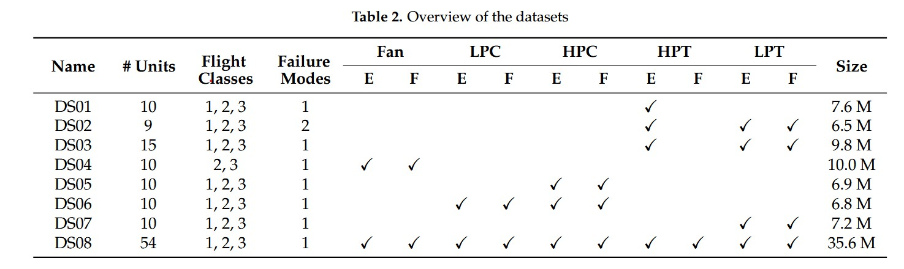

# N-CMAPSS LSTM Baseline

## 1. 数据集概述

本项目是基于 NASA 提供的 N-CMAPSS 发动机退化数据集构建的LSTM 基线模型。

以下所有介绍来自[1]，数据集通过物理仿真方式生成，其核心思想是利用非线性发动机动力学模型模拟真实飞行环境下的发动机退化过程。

数据生成流程如下：

### Step 1：定义飞行工况 W

使用真实商用喷气式飞机的飞行记录数据（来源：NASA DASHlink）
这些变量描述飞机在不同飞行阶段（爬升、巡航、下降）下的工况条件,一共有alt，Mach，TRA，T2四个值。

---

### Step 2：定义健康参数 θ 并施加退化

对发动机五个旋转部件施加退化：

- Fan
- LPC（Low Pressure Compressor）
- HPC（High Pressure Compressor）
- LPT（Low Pressure Turbine）
- HPT（High Pressure Turbine）

每个部件包含两个健康参数：

- Flow efficiency
- Pressure efficiency

因此总共有 10 个健康参数，取值范围为 0–1。

---

### Step 3：模拟退化飞行

利用 CMAPSS 非线性动力学模型进行仿真：
$
\left[ \hat{x}_s^{(t)}, \hat{x}_v^{(t)} \right] = F(w^{(t)}, \theta^{(t)})
$

即：

- 输入：飞行工况 $w^{(t)}$ 和健康参数 $\theta^{(t)}$
- 输出：
  - 可观测传感器 $x_s^{(t)}$ 14个
  - 虚拟传感器 $x_v^{(t)}$ 14个

每个 cycle 对应一次完整飞行过程。

---

### Step 4：持续飞行直至失效

重复步骤 1–3，并逐渐增加退化程度，直到：

Health Index (HI) = 0

此时定义为发动机寿命终点。

---

### Step 5：添加传感器噪声

为模拟真实环境，在生成数据中加入传感器噪声。

---
## 总结

**数据集利用$w^{(t)}$（4个）和$\theta^{(t)}$（对发动机5个部件分别2个）生成了$x_s^{(t)}$（14个）和$x_v^{(t)}$（14个）**

**在接下来的建模里面，由于我们需要做的实际上是根据传感器采集的数据以及飞机的工况预测RUL，所以能直接用到的参数，只能是$w^{(t)}$和$x_s^{(t)}$**

---

## 2. 数据文件结构
对于不同的.h5文件，施加退化的原件是不同的，同时在飞行等级（短/中/长途）也有差异，细节见图

而每一个.h5中包含以下变量组：
A_dev, A_test, A_var
T_dev, T_test, T_var
W_dev, W_test, W_var
X_s_dev, X_s_test, X_s_var
X_v_dev, X_v_test, X_v_var
Y_dev, Y_test

含义说明：

- `_dev`：开发集（用于训练与验证）
- `_test`：测试集（按发动机划分）
- `_var`：变量名称

变量含义：

| 变量 | 含义 |
|------|------|
| A | 辅助数据 |
| T | 健康参数 θ |
| W | 飞行工况 |
| X_s | 可观测物理传感器 |
| X_v | 虚拟传感器 |
| Y | 剩余寿命（RUL） |

---

## 3. 变量说明

### 3.1 可观测传感器 Xs

（14 个物理传感器变量）

| # | Symbol | Description | Units |
|---|--------|------------|-------|
| 1 | Wf | Fuel flow | pps |
| 2 | Nf | Physical fan speed | rpm |
| 3 | Nc | Physical core speed | rpm |
| 4 | T24 | Total temperature at LPC outlet | °R |
| 5 | T30 | Total temperature at HPC outlet | °R |
| 6 | T48 | Total temperature at HPT outlet | °R |
| 7 | T50 | Total temperature at LPT outlet | °R |
| 8 | P15 | Total pressure in bypass duct | psia |
| 9 | P2 | Total pressure at fan inlet | psia |
| 10 | P21 | Total pressure at fan outlet | psia |
| 11 | P24 | Total pressure at LPC outlet | psia |
| 12 | Ps30 | Static pressure at HPC outlet | psia |
| 13 | P40 | Total pressure at burner outlet | psia |
| 14 | P50 | Total pressure at LPT outlet | psia |

---

### 3.2 虚拟传感器 Xv

（14 个内部物理变量，无法真实测量）

| # | Symbol | Description | Units |
|---|--------|------------|-------|
| 1 | T40 | Total temperature at burner outlet | °R |
| 2 | P30 | Total pressure at HPC outlet | psia |
| 3 | P45 | Total pressure at HPT outlet | psia |
| 4 | W21 | Fan flow | pps |
| 5 | W22 | Flow out of LPC | lbm/s |
| 6 | W25 | Flow into HPC | lbm/s |
| 7 | W31 | HPT coolant bleed | lbm/s |
| 8 | W32 | HPT coolant bleed | lbm/s |
| 9 | W48 | Flow out of HPT | lbm/s |
| 10 | W50 | Flow out of LPT | lbm/s |
| 11 | SmFan | Fan stall margin | - |
| 12 | SmLPC | LPC stall margin | - |
| 13 | SmHPC | HPC stall margin | - |
| 14 | phi | Ratio of fuel flow to Ps30 | pps/psi |

这些变量均为物理量，具有构建 PINN（Physics-Informed Neural Network）的潜力。

---

### 3.3 飞行工况 W

| # | Symbol | Description | Units |
|---|--------|------------|-------|
| 1 | alt | Altitude | ft |
| 2 | Mach | Flight Mach number | - |
| 3 | TRA | Throttle–resolver angle | % |
| 4 | T2 | Total temperature at fan inlet | °R |

这些均为真实采集的飞行数据。

---

### 3.4 辅助变量 A

| # | Symbol | Description |
|---|--------|------------|
| 1 | unit | Engine unit number |
| 2 | cycle | Flight cycle number |
| 3 | Fc | Flight class |
| 4 | hs | Health state |

辅助变量仅用于索引和数据组织，不参与建模。

---

### *3.5 unit

数据集内部根据不同unit划分好了测试集和训练集，它们之间的工况存在差异。

---

## 4. Baseline 建模策略

本项目的 LSTM Baseline 设置主要参考[2]：
主要在于
- 输入：Xs + W(纯数据驱动)
- 输出：Y（RUL）  

LSTM网络结构为3层LSTM（hidden_size=20）+FC50全连接+ReLU线性输出到 1
滑动窗口 50，步长1
Optimizer = Mini-batch SGD + AMSGrad

初始化 = Xavier

batch_size = 1024

learning_rate = 0.001

Early stopping patience = 5

这样可以保证与已有文献的公平对比。

## 5. 参考文献
[1]Arias Chao, M.; Kulkarni, C.; Goebel, K.; Fink, O. Aircraft Engine Run-to-Failure Dataset under Real Flight Conditions for Prognostics and Diagnostics. Data 2021, 6, 5. https://doi.org/10.3390/data6010005
[2]Manuel Arias Chao, Chetan Kulkarni, Kai Goebel, Olga Fink,Fusing physics-based and deep learning models for prognostics,Reliability Engineering & System Safety,Volume 217,2022,107961,ISSN 0951-8320,https://doi.org/10.1016/j.ress.2021.107961.